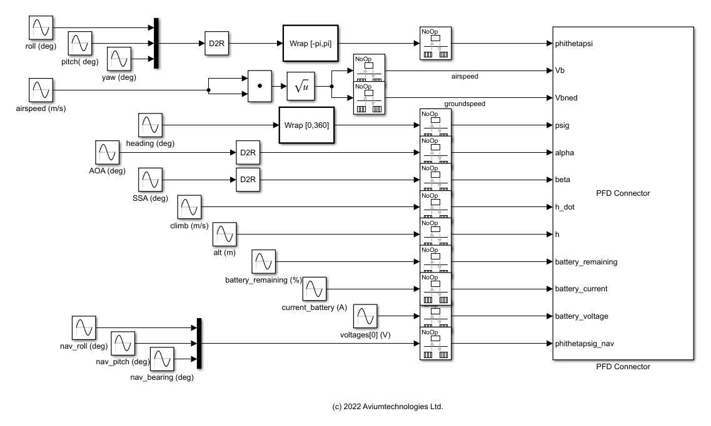

# Connector for Aviumtechnologies Primary Flight Display (PFD)

Simulink C++ S-function for connecting the Aviumtechnologies PFD to Simulink.

Requirements

- MATLAB & Simulink (MATLAB R2022a or earlier)
- MinGW-w64 or MSVC C/C++ Compiler
- Aviumtechnologies PFD application

Build instructions

-  Install MATLAB-supported compiler  
https://mathworks.com/support/requirements/supported-compilers.html.
-  Download the "pfd_connector.cpp" and "make.m" files and the "includes.zip" archive.
-  Unzip the "includes.zip archive".
-  Run "make.m" to create a "pfd_connector.mexw64" (Windows), "pfd_connector.mexa64" (Linux), "pfd_connector.mexmaci64" (macOS) file.

Use instructions

- Download and run Aviumtechnologies PFD application  [https://fst.aviumtechnologies.com](https://fst.aviumtechnologies.com).
- Open and run "pfd_connector_example.slx".

Example use of the Aviumtechnologies PFD connector

Aviumtechnologies PFD connector example

Additional information available at

https://fst.aviumtechnologies.com